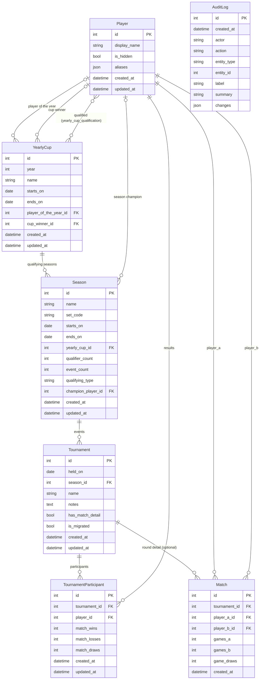

# mm-ladder — Database Schema

## Context

mm-ladder is a leaderboard for **Magic Mates Monday**, a weekly Booster Draft FNM at Chromatic Games. It rebuilds the limitedspoiler.com leaderboard (reference: LimitedSpoiler / ThornyBlueCactus) retaining only the leaderboard subset.

---

## Tech Stack

| Concern    | Choice                                             |
|------------|----------------------------------------------------|
| Language   | Python 3.13+                                       |
| ORM        | SQLAlchemy 2.0 (typed `Mapped[...]` style)         |
| Migrations | Alembic                                            |
| DB engine  | SQLite (file on disk) for dev; Postgres later      |
| Schemas    | Pydantic v2 (`BaseModel`, `@computed_field`)       |
| Packaging  | Poetry (pyproject.toml + poetry.lock)              |
| Tests      | pytest, in-memory SQLite per test                  |

**Postgres readiness:** only SQLAlchemy types and dialects that work on both engines are used. Migrating to Postgres is a connection-string change plus `alembic upgrade head` on the new engine.

---

## Relational Graph

---

## Tables

### Player

| Column       | Type                  | Notes                                               |
|--------------|-----------------------|-----------------------------------------------------|
| id           | int PK                |                                                     |
| display_name | str, required         | sole public identifier; shown on leaderboard        |
| is_hidden    | bool, default false   | true = excluded from leaderboard, history preserved |
| aliases      | json (`list[str]`), default `[]` | alternate spellings merged into this player (accents, initials, punctuation variants); exposed on `PlayerRead` and editable via the player PUT/PATCH (admin) |
| created_at   | datetime              |                                                     |
| updated_at   | datetime              |                                                     |

**Decision — display_name only:** email and full name are not captured at this stage. `display_name` is the sole player identifier. PII fields can be added later once a privacy/removal workflow is defined.

**Decision — `is_hidden` soft-delete:** `is_hidden` replaces the legacy `Ignore` flag from limitedspoiler.com. Privacy requests result in a soft-hide rather than a hard delete so that aggregate stats for other players remain correct. History is never destroyed.

**Decision — `aliases` for duplicate prevention:** when a player is created (or imported) under a name that normalises (accent/punctuation/case-insensitive token match) to an existing `display_name` or known alias, the existing player is reused and the new spelling is recorded as an alias instead of creating a duplicate row (`mm_ladder.services.player_matching`). The `migrate consolidate-players` CLI command performs the same matching retroactively to merge pre-existing duplicates: it repoints `tournament_participant`/`match` references to a chosen survivor, records the merged-away names as aliases, and deletes the duplicate rows.

**`is_veteran` (computed, not a column):** `true` once a player has played more than 52 events all-time (`VETERAN_THRESHOLD`), computed via a correlated subquery in `PlayerService.list` / `StandingsService` and exposed on `PlayerRead.is_veteran` / `SeasonStandingRead.is_veteran`.

**Trophy case (computed properties, not columns):** `season_champion_set_codes`, `player_of_the_year_cup_names`, and `cup_champion_cup_names` assemble a player's awards from the `Season.champion_player_id` / `YearlyCup.player_of_the_year_id` / `YearlyCup.cup_winner_id` back-references (exposed on `PlayerRead`, populated by `GET /players/{id}`). `SeasonStandingRead` additionally exposes `season_championships` (`{set_code, season_name}[]`), `player_of_the_year_years`, and `cup_champion_years` for the leaderboard award icons.

---

### YearlyCup

| Column     | Type          | Notes                       |
|------------|---------------|-----------------------------|
| id                   | int PK             |                             |
| year                 | int, unique        | e.g. 2024                   |
| name                 | str                | e.g. "2024 Magic Mates Cup" |
| starts_on            | date               |                             |
| ends_on              | date               |                             |
| player_of_the_year_id| FK Player, null    | the cup's Player of the Year (manually assigned) |
| cup_winner_id        | FK Player, null    | the cup's playoff winner (manually assigned)     |
| created_at           | datetime           |                             |
| updated_at           | datetime           |                             |

**Qualified players (`yearly_cup_qualification`):** a many-to-many association table
(`yearly_cup_id`, `player_id`; composite PK) tracking the players an admin has marked qualified for
a cup's playoff. Exposed on `YearlyCupRead` as `qualified_player_ids`; settable via the cup
create/update/patch requests. `player_of_the_year_name` / `cup_winner_name` are derived (display
names) on `YearlyCupRead`.

---

### Season

| Column          | Type                | Notes                                                  |
|-----------------|---------------------|--------------------------------------------------------|
| id              | int PK              |                                                        |
| name            | str                 | e.g. "Lorwyn Eclipsed"                                 |
| set_code        | str, unique         | e.g. "LCI"                                             |
| starts_on       | date                |                                                        |
| ends_on         | date                |                                                        |
| yearly_cup_id   | FK YearlyCup, null  | null = standalone (non-qualifying) season              |
| qualifier_count | int, default 2      | only meaningful when `yearly_cup_id` is set            |
| event_count     | int, default 12     | number of scheduled events in the season               |
| qualifying_type | str, default `"POINTS"` | `"POINTS"` or `"BEST"` — drives cup-qualification ranking (see below) |
| champion_player_id | FK Player, null  | the season champion (manually assigned). Exposed on `SeasonRead` as `champion_player_id` + derived `champion_name` |
| created_at      | datetime            |                                                        |
| updated_at      | datetime            |                                                        |

**`comp_avg_n` (computed, not a column):** Python property `ceil(event_count * 0.66)` — the number of top per-event scores averaged into `comp_avg`, exposed in `SeasonRead`/`SeasonStandingRead`.

**Decision — qualifying vs standalone:** a season is "qualifying" iff `yearly_cup_id IS NOT NULL`. No boolean flag needed — the FK presence carries the meaning.

**Decision — `qualifying_type`:** controls how `GET /seasons/{id}/standings` ranks players for cup qualification — `POINTS` sorts by total points, `BEST` sorts by `comp_avg` (the mean of a player's top `comp_avg_n` event scores). Both tiebreak on trophies, then win %. Derived from each season's start date at import time (`BEST` from War of the Spark / 2019-04-27 onward — `migration.seasons.BEST_QUALIFYING_FROM`; `POINTS` before, and for non-qualifying seasons) and persisted so it can be overridden per-season later.

**Decision — seeded via the migrate CLI:** Season rows are created by the migrate pipeline, not Alembic — `migration.importer.ensure_season` upserts each season (name, set_code, dates, `qualifying_type`) from the version-controlled `migration.seasons.SEASONS` list while importing scraped results, and `migrate seed-cups` (`migration.importer.seed_cups`) creates the `YearlyCup` rows and links each season's `yearly_cup_id`. (Alembic revision `0002` was removed; the chain runs `0001` → `0003`.)

---

### Tournament

| Column           | Type                | Notes                                  |
|------------------|---------------------|----------------------------------------|
| id               | int PK              |                                        |
| held_on          | date                | event date                             |
| season_id        | FK Season           |                                        |
| name             | str, null           | e.g. "MMM #143"                        |
| notes            | text, null          |                                        |
| has_match_detail | bool, default false | true once Match rows exist             |
| is_migrated      | bool, default false | true for events backfilled by `migrate migrate` from limitedspoiler.com (vs. created live via the API) |
| created_at       | datetime            |                                        |
| updated_at       | datetime            |                                        |

**Decision — no direct YearlyCup FK:** a Tournament belongs to a Season; its cup affiliation is transitive via `Season.yearly_cup_id`. Denormalising a direct FK to YearlyCup would create redundant, potentially inconsistent state.

**Decision — multiple pods per date:** multiple Tournament rows can share the same `held_on` date. When attendance exceeds ~10 players the league splits into two pods; each pod is its own Tournament row.

**Decision — `has_match_detail` flag:** avoids a JOIN to check whether Match rows exist. Set to `true` at write time when the first Match row is inserted for this tournament.

---

### TournamentParticipant

| Column        | Type           | Notes                                  |
|---------------|----------------|----------------------------------------|
| id            | int PK         |                                        |
| tournament_id | FK Tournament  |                                        |
| player_id     | FK Player      |                                        |
| match_wins    | int, default 0  |                                        |
| match_losses  | int, default 0  |                                        |
| match_draws   | int, default 0  |                                        |
| points        | int, computed   | `match_wins * 3 + match_draws`, DB-persisted |
| created_at    | datetime        |                                        |
| updated_at    | datetime        |                                        |

Unique constraint: `(tournament_id, player_id)`.

**`points` — DB-persisted Computed column:** `Computed("match_wins * 3 + match_draws", persisted=True)`. The DB owns the calculation; the column is stored and queryable directly. Exposed as a plain `int` in `TournamentParticipantRead`.

**Decision — primary leaderboard source:** this table is what the leaderboard reads. For backfilled (legacy) events it is the only source of truth. For events with `has_match_detail = true` it is a materialised aggregate of Match rows, kept in sync at write time. This dual-mode design allows a clean migration path from aggregate-only data to full round detail.

**Decision — backfill support:** the aggregate columns (`match_wins`, `match_losses`, `match_draws`) allow direct import from the existing W/L export on limitedspoiler.com without requiring per-round data.

---

### Match

| Column        | Type           | Notes                            |
|---------------|----------------|----------------------------------|
| id            | int PK         |                                  |
| tournament_id | FK Tournament  |                                  |
| player_a_id   | FK Player      |                                  |
| player_b_id   | FK Player      |                                  |
| games_a       | int, default 0 | game wins for player_a           |
| games_b       | int, default 0 | game wins for player_b           |
| game_draws    | int, default 0 | drawn games (timeouts etc.)      |
| created_at    | datetime       |                                  |

Constraint: `player_a_id <> player_b_id`.

**`outcome` — Pydantic `@computed_field`:** `A_WINS` / `B_WINS` / `DRAW`, derived in `MatchRead` by comparing `games_a` vs `games_b`. Not stored in the DB. Supported score lines: `2-0`, `2-1`, `1-1-1`, `1-0-1`, `0-0-1`.

**Decision — optional round detail:** Match rows only exist for new events where round-by-round data is captured. Absence of Match rows for a Tournament does not indicate missing data — it indicates the event was backfilled at aggregate level.

**Decision — ELO ready:** ELO calculations (future phase) will read directly from this table. Events without Match rows simply produce no ELO delta.

---

### AuditLog

Append-only record of every admin write (created via the admin-guarded API; the migrate CLI/pipeline is not logged). Added in migration `0009_add_audit_log`.

| Column      | Type                  | Notes                                                       |
|-------------|-----------------------|-------------------------------------------------------------|
| id          | int PK                |                                                             |
| created_at  | datetime              | when the change was recorded                                |
| updated_at  | datetime              | unused (from the shared timestamp mixin)                    |
| actor       | str, default `"admin"`| the acting admin (single shared token → constant `"admin"`) |
| action      | str                   | `CREATE` / `UPDATE` / `DELETE`                              |
| entity_type | str                   | `player` / `season` / `yearly_cup` / `tournament` / `participant` / `match` |
| entity_id   | int, null             | the affected row's id                                       |
| label       | str                   | human label, e.g. `Player "Alice"`                          |
| summary     | str                   | one-line description, e.g. `display_name: "Alice" → "Alyce"` |
| changes     | json                  | list of `{field, old, new}`; CREATE → `old` null, DELETE → `new` null |

**Decision — append-only, written in-transaction:** an `AuditRecorder` adds the row to the same
session as the mutation it describes (atomic), so the log can't drift from the data. There are no
update/delete routes for audit rows. Served by `GET /admin/audit` (filter by `entity_type`/`action`,
paginated).

---

## Constraints Summary

| Table                 | Constraint                                        |
|-----------------------|---------------------------------------------------|
| YearlyCup             | `year` unique                                     |
| Season                | `set_code` unique                                 |
| TournamentParticipant | UNIQUE `(tournament_id, player_id)`               |
| Match                 | `CHECK player_a_id <> player_b_id`                |
| yearly_cup_qualification | composite PK `(yearly_cup_id, player_id)`      |

---

## Cup Qualifiers

Cup qualification is **manually curated and materialised** in the `yearly_cup_qualification`
association table (`yearly_cup_id`, `player_id`; composite PK — see the YearlyCup section). An admin
sets a cup's qualified players through the portal / cup create/update/patch requests, and they are
exposed on `YearlyCupRead.qualified_player_ids`.

Ranking is still **computed on read** as an input to that decision: `GET /seasons/{id}/standings`
orders players by the season's `qualifying_type` (`POINTS` → total points; `BEST` → `comp_avg`), both
tiebreaking on trophies then win %. `qualifier_count` records how many top players a qualifying season
sends to the cup. The admin uses that ranking to choose whom to mark qualified — the table is not
auto-populated, so ties and declines can be handled by hand.

